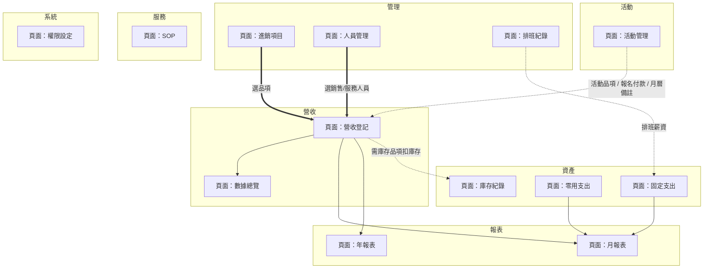
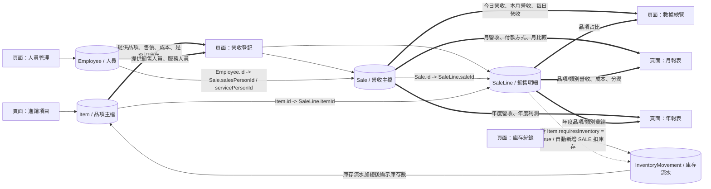
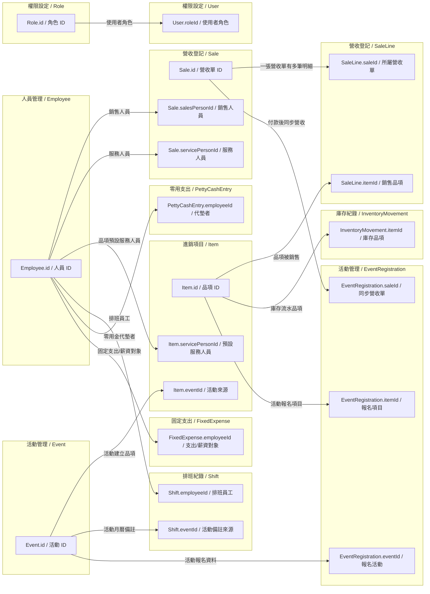
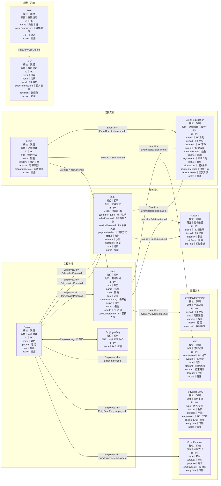

# ERP 頁面資料關係說明

## 一、讀圖方式

本文件依 `http://localhost:3000` dev app 目前側邊欄頁面整理。

1. 外框是側邊欄模組。
2. 白色節點是實際頁面。
3. 圓柱節點是資料表。
4. 粗線表示頁面之間的強關聯。
5. 實線表示頁面讀寫資料表，或資料表之間的外鍵關聯。
6. 虛線表示同步產生、報表彙總或權限控制。

目前側邊欄頁面為：營收登記、數據總覽、進銷項目、人員管理、排班紀錄、月報表、年報表、庫存紀錄、零用支出、固定支出、活動管理、SOP、權限設定。

## 二、頁面模組總覽

這張只放側邊欄頁面，不放資料表。先看模組位置與頁面之間的主流程。

## 三、營收核心關聯

這張只看營收核心資料流向：進銷項目與人員管理提供輸入，營收登記寫入營收主檔與銷售明細，營收資料再流向數據總覽、月報表、年報表；需庫存品項會同步產生庫存流水。

## 四、模組、頁面與資料庫關聯

這一節用表格取代多張局部圖，集中說明每個側邊欄模組、頁面與資料表的關聯。

| 模組 | 頁面 | 主要寫入資料表 | 主要讀取 / 關聯資料表 | 資料庫關聯重點 |
| --- | --- | --- | --- | --- |
| 營收 | 營收登記 | Sale、SaleLine | Item、Employee、InventoryMovement | Sale 是營收主檔；SaleLine 是明細。SaleLine 以 `itemId` 連 Item；Sale 以 `salesPersonId`、`servicePersonId` 連 Employee；需庫存品項銷售時同步新增 InventoryMovement。 |
| 營收 | 數據總覽 | 無 | Sale、SaleLine、Item | 只讀取 `CLOSED` 營收，彙總今日、本月、每日營收與品項占比。 |
| 管理 | 進銷項目 | Item | InventoryMovement、Event、Employee | Item 是營收登記選品項來源；庫存數由 InventoryMovement 加總；活動管理可建立 `eventId` 對應的活動品項；部分品項可連服務人員。 |
| 管理 | 人員管理 | Employee、EmployeeTag | Sale、Shift、PettyCashEntry、FixedExpense | Employee 供營收登記、排班、零用支出、固定支出共用；EmployeeTag 用於人員分類與部分下拉過濾。 |
| 管理 | 排班紀錄 | Shift | Employee、Event | Shift 以 `employeeId` 連 Employee；活動日期備註可由 Event 同步建立；外部員工排班日數會被固定支出與報表用來推算薪資。 |
| 報表 | 月報表 | 無 | Sale、SaleLine、Item、FixedExpense、PettyCashEntry、Shift、Event、Employee | 彙總月營收、品項類別、付款方式、活動占比、固定支出、零用支出、排班薪資與服務分潤。 |
| 報表 | 年報表 | 無 | Sale、SaleLine、FixedExpense、PettyCashEntry、Shift、Employee | 彙總年度營收、年度成本、年度利潤與員工給付。 |
| 資產 | 庫存紀錄 | InventoryMovement | Item | 每筆庫存異動都連到 Item；庫存是流水加總，不直接存於 Item。 |
| 資產 | 零用支出 | PettyCashEntry | Employee | 每筆零用金收入/支出可用 `employeeId` 連代墊者；報表用於現金收入支出。 |
| 資產 | 固定支出 | FixedExpense | Employee、Shift | 固定支出可用 `employeeId` 連支出或薪資對象；頁面也會讀 Shift 推算外部員工系統薪資列。 |
| 活動 | 活動管理 | Event、EventRegistration、Item、Shift、Sale、SaleLine | Item、Shift、Sale | Event 是活動主檔；活動頁可同步建立活動 Item、活動日期 Shift 備註；報名付款資料寫入 EventRegistration，付款後同步 Sale/SaleLine。 |
| 服務 | SOP | Sop、SopStep | 無跨模組必要關聯 | Sop 是流程主檔；SopStep 以 `sopId` 連 Sop。 |
| 系統 | 權限設定 | User、Role | pagePermissions | User 可連 Role；Role 與 User 都以 `pagePermissions` 控制頁面/API 可操作範圍。 |

## 五、頁面欄位層級關聯

這一節用「來源頁面欄位 -> 目標頁面欄位」說明每個頁面資料庫欄位實際連到哪裡。

### 精準欄位連線圖

這張圖把每個關鍵資料欄位拆開成獨立節點，線會直接連到另一張表的對應欄位。

### 資料表關聯圖

| 來源頁面 | 來源資料表.欄位 | 來源頁面欄位/用途 | 目標頁面 | 目標資料表.欄位 | 目標頁面欄位/用途 | 關聯類型 |
| --- | --- | --- | --- | --- | --- | --- |
| 營收登記 | SaleLine.itemId | 銷售明細的品項 | 進銷項目 | Item.id | 品項主檔 ID | 外鍵；營收登記選品項。 |
| 營收登記 | Sale.salesPersonId | 銷售人員 | 人員管理 | Employee.id | 人員 ID | 外鍵；記錄本筆營收由誰銷售。 |
| 營收登記 | Sale.servicePersonId | 服務人員 | 人員管理 | Employee.id | 人員 ID | 外鍵；報表用於服務分潤與員工給付。 |
| 營收登記 | Sale.id | 營收單 ID | 營收登記 | SaleLine.saleId | 銷售明細所屬營收單 | 一對多；一筆營收可有多筆銷售明細。 |
| 營收登記 | Sale.soldAt | 銷售日期 | 數據總覽 / 月報表 / 年報表 | Sale.soldAt | 報表期間篩選 | 彙總條件；依日期計算今日、本月、年度營收。 |
| 營收登記 | Sale.status | 營收狀態 | 數據總覽 / 月報表 / 年報表 | Sale.status | 報表只統計 CLOSED | 彙總條件；只計入已結案營收。 |
| 營收登記 | Sale.paymentMethod | 付款方式 | 月報表 | Sale.paymentMethod | 付款方式分析 | 彙總欄位；依付款方式加總營收。 |
| 營收登記 | SaleLine.lineTotal | 明細金額 | 數據總覽 / 月報表 / 年報表 | SaleLine.lineTotal | 品項與類別營收 | 彙總欄位；用於品項占比與類別分析。 |
| 營收登記 | SaleLine.quantity | 銷售數量 | 月報表 | SaleLine.quantity | 品項銷量、服務分潤 | 彙總欄位；課程以外項目多以金額比例計算分潤。 |
| 營收登記 | SaleLine.itemId | 需庫存品項 | 庫存紀錄 | InventoryMovement.itemId | 庫存異動品項 | 同步產生；銷售需庫存品項時新增扣庫存流水。 |
| 營收登記 | Sale.id | 營收單 ID | 庫存紀錄 | InventoryMovement.reason | 銷售單來源 | 同步產生；reason 會寫入 `銷售單 {saleId}` 方便追蹤。 |
| 進銷項目 | Item.id | 品項 ID | 庫存紀錄 | InventoryMovement.itemId | 庫存異動品項 | 外鍵；所有庫存流水都掛在品項下。 |
| 進銷項目 | Item.requiresInventory | 是否需要庫存 | 營收登記 / 庫存紀錄 | InventoryMovement.type、quantity | 是否銷售扣庫存 | 業務規則；只有需庫存品項銷售時自動扣庫存。 |
| 進銷項目 | Item.cost | 品項成本 | 月報表 | Item.cost | 毛利成本來源 | 彙總欄位；報表以成本計算毛利參考。 |
| 進銷項目 | Item.type | 品項類型 | 月報表 | Item.type | 類別分析、分潤規則 | 彙總欄位；用於品項類別營收與服務分潤。 |
| 進銷項目 | Item.eventId | 活動來源 | 活動管理 | Event.id | 活動 ID | 外鍵；活動建立的品項會連回活動。 |
| 進銷項目 | Item.servicePersonId | 預設服務人員 | 人員管理 | Employee.id | 人員 ID | 外鍵；營收選品項時可帶入服務人員。 |
| 人員管理 | Employee.id | 人員 ID | 排班紀錄 | Shift.employeeId | 排班員工 | 外鍵；排班紀錄選員工。 |
| 人員管理 | Employee.id | 人員 ID | 零用支出 | PettyCashEntry.employeeId | 代墊者 | 外鍵；支出可記錄代墊者。 |
| 人員管理 | Employee.id | 人員 ID | 固定支出 | FixedExpense.employeeId | 支出/薪資對象 | 外鍵；固定支出可指定員工或支出對象。 |
| 人員管理 | Employee.id | 人員 ID | 進銷項目 | Item.servicePersonId | 品項預設服務人員 | 外鍵；品項可連到服務人員。 |
| 人員管理 | EmployeeTag.id | TAG ID | 人員管理 | Employee.tags | 人員 TAG | 多對多；用於分類內部員工、外部員工、合作廠商等。 |
| 人員管理 | Employee.tags | 人員分類 | 營收登記 | Employee.tags | 服務人員下拉過濾 | 業務規則；營收登記依 TAG 過濾可選服務人員。 |
| 人員管理 | Employee.tags | 人員分類 | 固定支出 / 月報表 | Employee.tags | 外部員工薪資推算 | 業務規則；外部員工排班天數會推算薪資。 |
| 排班紀錄 | Shift.employeeId | 排班員工 | 人員管理 | Employee.id | 人員 ID | 外鍵；排班屬於某位人員。 |
| 排班紀錄 | Shift.eventId | 活動排班/備註 | 活動管理 | Event.id | 活動 ID | 外鍵；活動日期可同步建立排班月曆備註。 |
| 排班紀錄 | Shift.startsAt | 排班日期 | 固定支出 / 月報表 | Shift.startsAt | 排班日數 | 彙總條件；以日期計算外部員工排班薪資。 |
| 固定支出 | FixedExpense.employeeId | 支出/薪資對象 | 人員管理 | Employee.id | 人員 ID | 外鍵；固定支出可掛人員。 |
| 固定支出 | FixedExpense.entryDate | 支出日期 | 月報表 / 年報表 | FixedExpense.entryDate | 報表期間篩選 | 彙總條件；依月份或年度計入支出。 |
| 固定支出 | FixedExpense.amount | 支出金額 | 月報表 / 年報表 | FixedExpense.amount | 固定成本 | 彙總欄位；計入成本與毛利。 |
| 零用支出 | PettyCashEntry.employeeId | 代墊者 | 人員管理 | Employee.id | 人員 ID | 外鍵；零用支出可掛人員。 |
| 零用支出 | PettyCashEntry.entryDate | 零用金日期 | 月報表 / 年報表 | PettyCashEntry.entryDate | 報表期間篩選 | 彙總條件；依月份或年度計入現金收支。 |
| 零用支出 | PettyCashEntry.amount、type | 金額與收入/支出類型 | 月報表 / 年報表 | PettyCashEntry.amount、type | 現金收入支出 | 彙總欄位；分別加總收入與支出。 |
| 活動管理 | Event.id | 活動 ID | 進銷項目 | Item.eventId | 活動品項來源 | 外鍵/同步；活動頁建立的品項會寫入 Item 並連回 Event。 |
| 活動管理 | Event.id | 活動 ID | 排班紀錄 | Shift.eventId | 活動月曆備註 | 外鍵/同步；活動日期會同步建立 Shift 備註。 |
| 活動管理 | EventRegistration.eventId | 報名所屬活動 | 活動管理 | Event.id | 活動 ID | 外鍵；報名資料掛在活動下。 |
| 活動管理 | EventRegistration.itemId | 報名項目 | 進銷項目 | Item.id | 活動品項 | 外鍵；報名付款選擇活動品項。 |
| 活動管理 | EventRegistration.saleId | 同步營收單 | 營收登記 | Sale.id | 營收單 ID | 同步關聯；付款後建立 Sale 並回寫 saleId。 |
| 活動管理 | EventRegistration.paidAmount | 報名付款金額 | 營收登記 | Sale.total、SaleLine.lineTotal | 營收金額 | 同步產生；付款金額寫入營收主檔與明細。 |
| 活動管理 | EventRegistration.paymentMethod | 報名付款方式 | 營收登記 | Sale.paymentMethod | 營收付款方式 | 同步產生；活動付款方式進入營收與月報表。 |
| 權限設定 | Role.id | 角色 ID | 權限設定 | User.roleId | 使用者角色 | 外鍵；使用者可套用角色。 |
| 權限設定 | Role.pagePermissions | 角色頁面權限 | 全部受保護頁面/API | pagePermissions | 可操作頁面/API | 權限控制；角色提供預設權限。 |
| 權限設定 | User.pagePermissions | 使用者頁面權限 | 全部受保護頁面/API | pagePermissions | 可操作頁面/API | 權限控制；使用者可覆寫頁面權限。 |

## 六、核心資料流

| 流程 | 資料流 |
| --- | --- |
| 一般銷售 | 進銷項目 + 人員管理 -> 營收登記 -> Sale/SaleLine -> 數據總覽/月報表/年報表；若需庫存 -> InventoryMovement 扣庫存。 |
| 活動建置 | 活動管理 -> Event；同時可同步 Item 活動品項，並依活動日期建立 Shift 月曆備註。 |
| 活動報名付款 | 活動管理頁內的報名/付款資料 -> EventRegistration；付款後同步 Sale/SaleLine -> 數據總覽/月報表/年報表。 |
| 庫存管理 | 進銷項目設定需庫存 -> 庫存紀錄進貨/調整/耗用；營收登記銷售時自動新增銷售扣庫存紀錄。 |
| 人員薪資 / 分潤 | 人員管理 + 排班紀錄 + 固定支出 + 營收服務人員 -> 月報表/年報表計算排班薪資、固定薪資、服務分潤與員工給付。 |
| 現金與費用 | 零用支出 + 固定支出 + 營收登記 -> 月報表/年報表計算固定成本、零用支出、毛利與現金淨額。 |

## 七、報表計算資料來源

| 報表區塊 | 主要來源 | 計算概念 |
| --- | --- | --- |
| 營收 | Sale | 指定期間內 `status = CLOSED` 的 `total` 加總。 |
| 品項 / 類別分析 | SaleLine + Item | 依品項與品項類型加總數量與金額。 |
| 毛利 | SaleLine + Item | 月報另扣固定支出、零用支出與服務分潤。 |
| 付款方式分析 | Sale | 依 `paymentMethod` 加總營收。 |
| 活動營收占比 | SaleLine + Item.event | 銷售明細的品項若屬於活動，歸到該活動營收。 |
| 固定支出 | FixedExpense + Shift | 固定支出加總；月報另加入外部員工排班推算薪資。 |
| 零用支出 | PettyCashEntry | 分別加總收入與支出，並計算現金淨額。 |
| 員工給付 | Employee + Shift + FixedExpense + Sale | 固定薪資、外部員工排班日薪、服務分潤合併計算。 |
| 服務分潤 | Sale.servicePerson + SaleLine.item.type | 占卜/風水 50%、儀式 30%、實體商品 30%、香油 0。 |
